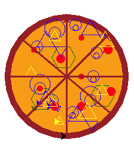

# Picasso's Pizzeria

## Table of Contents

- [Overview](#overview)
- [Tech Stack](#tech-stack)
- [Features](#features)
- [Video/Demo Link](#video-demo)
- [About the Developer](#developer)

## Overview

Do you have a love for pizza? How about making wacky, creative and "artistic" pizzas'? If so, take a break with this charming terminal-based game designed using Python with enhanced Turtle graphics. With the assistance of THE famous Picasso, you'll be guided to select a variety of toppings and pay for your very own pizza. So what are you waiting for? Come on in and experience Picasso's Pizzeria's "freshly" baked pizzas.

## Tech Stack

**Back End:** Python 
**Frameworks/Libraries:** Turtle Graphics 
 

## Features

# Choose from a variety of toppings

  

  
 

# Add, Edit, and Delete toppings

  

  
 

 

  
 

  

# Pay and add a tip

  

  
 

# Create unique pizzas

  

  
 

 

  
 

##  Video/Demo Link

### Video playthrough

 

 

### Demo link

<a href = "https://repl.it/@sw135/Project-Pizza#main.py">Repl.it Link Here</a>

## About the Developer

Biological scientist turned Software Engineer wanting to make a difference and change by creating applications and programs for our future leaders.

Learn more about Sarah on her <a href="https://www.linkedin.com/in/wong-s" target="_blank">LinkedIn.</a>
